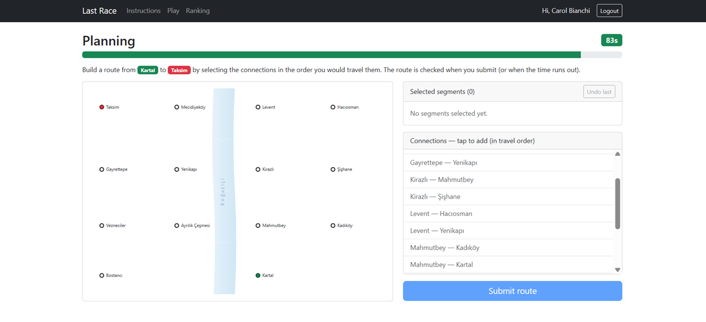
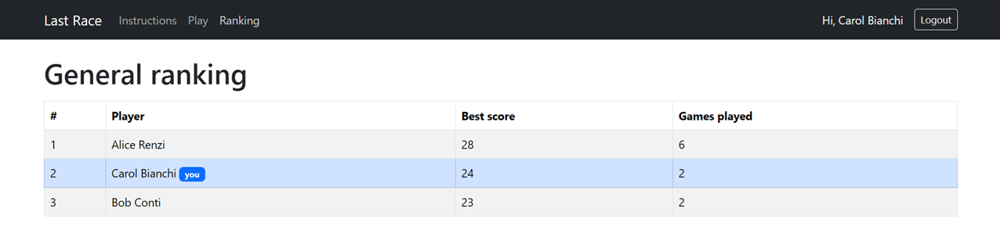

# Exam #1: "Last Race"
## Student: s343124 ORAL MUHAMMED EMIN

## React Client Application Routes

- Route `/`: home page with the game instructions. Anonymous users see only the instructions (no network map); logged-in users also get a link to start playing.
- Route `/login`: login form (username + password).
- Route `/game`: the whole game flow — Setup → Planning → Execution → Result — managed as a phase state machine within a single route. Logged-in only; redirects to `/login` if not authenticated.
- Route `/ranking`: general ranking, showing the best score per user. Logged-in only.
- Route `*`: not-found fallback for any unknown path.

## API Server

- POST `/api/sessions`
  - request body: `{ username, password }`
  - response body: `{ id, username, name }` on success, `401` on wrong credentials
- GET `/api/sessions/current`
  - request parameters: none (uses the session cookie)
  - response body: `{ id, username, name }` if logged in, `401` otherwise
- DELETE `/api/sessions/current`
  - request parameters: none
  - response body: empty, `200` (logout)
- GET `/api/network` (authenticated)
  - request parameters: none
  - response body: the full map `{ stations: [{ id, name, x, y, interchange }], lines: [{ id, name, color, stations: [stationId, ...] }] }`
- POST `/api/games` (authenticated)
  - request parameters: none — the server randomly assigns a start and a destination at least 3 segments apart
  - response body: `{ gameId, start: { id, name }, destination: { id, name }, stations: [{ id, name, x, y }], segments: [{ from: { id, name }, to: { id, name } }] }` (no line information is sent)
- POST `/api/games/:id/route` (authenticated)
  - request parameters: `id` (game id) in the URL; request body `{ route: [[fromId, toId], ...] }` (ordered, undirected segment pairs)
  - response body: `{ valid, score, steps: [{ from, to, event: { description, effect }, coins }], start, destination }`. An invalid or incomplete route returns `{ valid: false, score: 0, steps: [] }`
- GET `/api/ranking` (authenticated)
  - request parameters: none
  - response body: `[{ id, username, name, bestScore, gamesPlayed }]` (best score per user, finalised games only, ordered by score)

## Database Tables

- Table `stations` - the metro stations, with `x, y` coordinates used to draw the map.
- Table `metro_lines` - the lines, each with a display `color`.
- Table `line_stations` - ordered station membership per line; the segments (edges) are derived from consecutive entries.
- Table `events` - the random journey events, each with an `effect` from -4 to +4.
- Table `users` - the registered users; passwords stored as a scrypt `hash` with a per-user `salt`.
- Table `games` - every played game (user, start, destination, status, score, created_at); used to compute the ranking.

## Main React Components

- `App` (in `App.jsx`): root component; holds the authentication state, provides `AuthContext`, and defines the routes.
- `NavHeader` (in `NavHeader.jsx`): top navigation bar with links and login/logout.
- `LoginForm` (in `LoginForm.jsx`): controlled username/password login form.
- `HomePage` (in `HomePage.jsx`): the instructions page (guest vs logged-in view).
- `GamePage` (in `GamePage.jsx`): orchestrates the game as a phase state machine (setup → planning → execution → result), fetching from the API and passing data to each phase.
- `SetupPhase` (in `SetupPhase.jsx`): shows the full network map (lines + interchanges) before a game starts.
- `PlanningPhase` (in `PlanningPhase.jsx`): line-less map, the list of all connections, the free-selection route builder, and the 90-second timer (drift-free, deadline-based; auto-submits on timeout).
- `ExecutionPhase` (in `ExecutionPhase.jsx`): reveals the journey one segment at a time, showing each random event and the running coin total.
- `ResultPhase` (in `ResultPhase.jsx`): the final score plus a journey recap (a coin-total sparkline and the per-segment event breakdown).
- `NetworkMap` (in `NetworkMap.jsx`): declarative SVG map, reused with or without the lines; draws parallel offset strokes for segments shared by several lines, over a decorative Bosphorus backdrop.
- `RankingPage` (in `RankingPage.jsx`): the ranking table.

(only _main_ components, minor ones may be skipped)

## Screenshot

## Users Credentials

- `alice`, `wadventure` (has already played some games)
- `bob`, `metropass` (has already played some games)
- `carol`, `lastrace`

## Use of AI Tools

I used an AI assistant (Claude Opus 4.8) throughout the project: to discuss the
overall structure and design decisions, to draft initial implementations of the
React components and the Express endpoints, and to clarify React/Express/Passport
concepts. I reviewed, ran and tested all of the produced code locally, adapting it
where needed, and I unit-tested the pure game logic (BFS start/destination
selection, route validation and scoring) to confirm its correctness. I understand
how the code works and take full responsibility for it.
